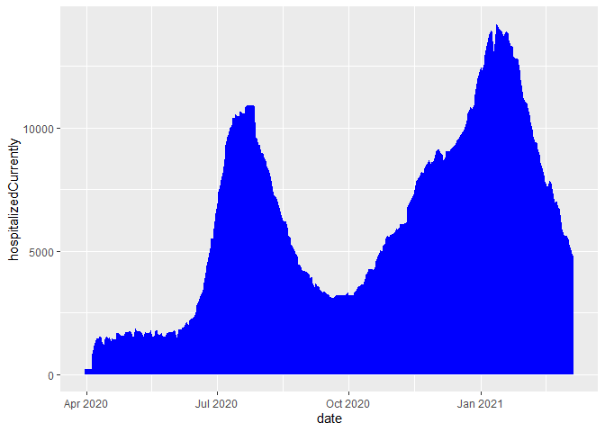

\#COVID-19 DEATH AND HOSPITALIZATION RATES IN TEXAS

Presentation ID: 5033

Simeon Alfa

Biosciences Department, Minnesota State University Moorhead, 1104 7th
Avenue South, Moorhead, MN 56563 USA

Presented at the MSUM 23rd Online Student Academic Conference

Submit a survey for this presentation:
<https://mnstate.co1.qualtrics.com/jfe/form/SV_eFMAwF72JZIoeSq>

## Abstract

Coronavirus disease (COVID-19) is an infectious disease caused by the
newly discovered coronavirus. The COVID-19 virus spreads primarily
through droplets of saliva or discharge from the nose when an infected
person coughs or sneezes. In the Us COVID-19 was declared a pandemic by
the WHO in March 2020. What is the effect of rate of hospitalization due
to COVID-19 in the spread of the virus? In this study we are going to
evaluate this question using Texas as a case study. with the aid of
exploratory data analysis, we are going to compare the hospitalization
rates and then compare it to the number of deaths recorded. From the
results of this data analysis, I should be able to conclude that that
increased hospitalization either increases or decreases the spread of
Covid in Texas

## Introduction

Exactly one year after COVID-19 pandemic hit most part of the United
States, there has yet to be a cure for this virus. It is also unknown
how much the mortality rates is affected by hospitalization. IT is
important to know if hospitalizing patients help parents recover. We put
this into consideration as there is no cure in hospitals that would
necessarily confer any type of advantage of hospitalization. What is the
correlation between the rate of hospitalization and the death rate in
Texas.Did hospitalization influence the death rate positively or
negatively?, or no correlation at all?

## Methods

### Data Acquisition

The data for this project was gathered from covid data tracking website
through the Lab website for Quantitative Biology.

This website ’’ The COVID Tracking Project at Atlantic’’(Atlantic covid
tracking, 2021) contained relevant covid statistics fro all the 50
states in the country. I did not have to request access for this
website, I just had to click the link, copy it into R Studio and run it
with the read csv function.

### Data Description

Each row in this data represent a day in the state of Texas. Data is
recorded everyday since the 3rd of March 2020 till the 7th of March
2021.The columns in the data represent the different statistical
variables in our data. The three variables used in this data were the
death, death increase and hospitalized currently

### Data Preparation

In this project we used Rstudio (R Core Team, 2021) to clean up and
prepare our data. First we loaded the tidyverse package (wickham et al,
2019) and we and we used the read\_csv function to load our data into
RStudio. We used the ggplot function to make pictorial representations
of our data through histograms, time series and line graphs.

## Results

The figures below are histograms which represent the frequency
distribution of the number of hospitalized patients, cumulative number
of deaths and daily increase in the number of deaths

<!-- --><!-- --><!-- -->

The figures below represent a time series of number of hospitalized
patients, cumulative number of deaths and daily increase in the number
of deaths
<!-- --><!-- --><!-- -->

The figures below represent a line graph of number of hospitalized
patients, cumulative number of deaths and daily increase in the number
of deaths

<!-- --><!-- --><!-- -->

## DISCUSSION

In figure 1 above, we have three histograms

## REFERENCES

-   R Core Team (2021). R: A language and environment for statistical
    computing. R Foundation for Statistical Computing, Vienna, Austria.
    URL <https://www.R-project.org/>.

-   Wickham et al., (2019). Welcome to the tidyverse. Journal of Open
    Source Software, 4(43), 1686, <https://doi.org/10.21105/joss.01686>
